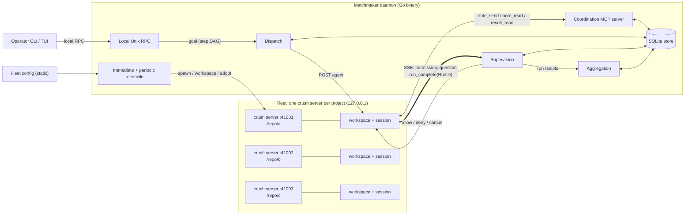

# Matchmaker: Crush Fleet Orchestration — Architecture Specification

Status: Draft
Date: 2026-08-23

## 1. Purpose

Matchmaker coordinates tasks among multiple independent
[Crush](https://github.com/charmbracelet/crush) agents to accomplish a goal.
Given a goal expressed as a graph of steps, Matchmaker routes each step to the
right Crush instance, supervises execution (permissions, retries, lifecycle),
lets agents pass notes to one another while working the same goal, and
aggregates outcomes into a unified result.

Matchmaker is implemented in **Go**, building on the
[charmbracelet](https://github.com/charmbracelet) ecosystem (§10). This document
defines the architecture. Matchmaker runs as one local daemon; CLI and TUI
commands are clients of that daemon (§3). Storage is embedded SQLite.

## 2. Background: Crush Server Mode

Crush ships a first-class client/server mode:

- `crush server [-H host]` starts a long-running process serving a REST API under
  `/v1` (Unix socket by default, TCP via `--host tcp://127.0.0.1:PORT`).
  Swagger docs at `/v1/docs/`.
- A **workspace** is an agent instance bound to a working directory
  (`POST /v1/workspaces`, keyed by the request's `path`). The root `--cwd` flag
  is a client concern; `crush server` itself loads global config and receives
  project paths through workspace creation.
- **Agent runs**: `POST /v1/workspaces/{id}/agent` submits a prompt. Sessions
  support `cancel`, `summarize`, and queued prompts.
- **Event stream**: `GET /v1/workspaces/{id}/events` is an SSE stream emitting
  `message`, `permission_request`, `session`, `run_complete` (carrying a
  `RunID`), LSP/MCP events, etc.
- **Supervision**: `POST .../permissions/grant`, `POST .../questions/answer`,
  `POST .../sessions/{sid}/cancel`.
- **Lifecycle**: `GET /v1/health` for readiness; `POST /v1/control` with
  `shutdown` / `shutdown_if_idle`.

### 2.1 Relevant constraints of the Crush server

- **C1 — Client-claim lifecycle.** A workspace's lifetime is tied to the
  claiming `client_id`: it is torn down after the client's last SSE stream
  detaches (plus a detach grace and a ~30s creation grace period; defaults
  ~10s/~30s, tunable via env). The server idle-shuts-down (~60s) when no
  workspaces remain. Clients announce exit with `DELETE /v1/clients/{id}`.
- **C2 — No authentication.** The API is single-user and local, with no auth,
  TLS, or origin checks on any endpoint (verified v0.91.2,
  [THREAT_MODEL.md](THREAT_MODEL.md) Appendix). TCP exposure requires
  external access control (bind to loopback, or front with a proxy).
- **C3 — No fleet awareness.** A Crush server knows nothing about other servers.
  Cross-instance coordination is entirely the orchestrator's job.
- **C4 — Version pinning.** Clients check server version/BuildID. Matchmaker
  fails closed on an unapproved mismatch; restarting the same binary is not a
  remediation.
- **C5 — Evolving API.** The REST surface is documented via the swagger spec
  in-repo, not a stable contract. Pin against a known Crush version per
  deployment.
- **C6 — Dangerous endpoints.** The API surface includes endpoints Matchmaker
  must never call: an unauthenticated remote shell
  (`POST .../agent/sessions/{sid}/shell`, no permission gate), runtime yolo
  (`POST .../permissions/skip`), and config mutation (`config/set`,
  `config/provider-key`). See §6 and THREAT_MODEL Appendix A1.
- **C7 — Executable config.** `crushrc`/`.crushrc` are shell scripts executed
  at config load, and config values undergo shell expansion (`$(cmd)`).
  Creating a workspace on a project executes its config (THREAT_MODEL A2).
- **C8 — In-memory permissions.** Permission grants (including
  `allow_session`) live only in the server process; a restart resets them.
  The only persistent grant is `allowed_tools` in config. There is no
  sandbox behind a grant: gated tools run with full user privileges.

## 3. Topology

**One Matchmaker daemon per state directory.** The long-running daemon exclusively
owns the SQLite store, reconciliation, Crush child processes, SSE claims, and
coordination MCP listener. It acquires an OS-level exclusive lock before opening
the store and exits if another owner is live. The lock records daemon identity
and socket path for diagnostics but is never treated as proof without the OS
lock.

CLI and TUI invocations are short-lived clients over an operator-only local Unix
socket in the state directory. The daemon creates the socket under a `0700`
directory, removes stale socket files only while holding the exclusive lock, and
uses peer OS identity plus socket permissions as the v1 trust boundary. Goal
submission, status, approvals, abandonment, report access, and shutdown use this
local RPC. Requests carry idempotency keys so a client retry cannot duplicate a
goal or operator action. A network HTTP API remains future work.

**One Crush server per project.** Each managed project runs its own
`crush server` process on a dedicated loopback TCP port. The daemon owns the
fleet.



The full rendering lives in [architecture.mmd](architecture.mmd)
([SVG](architecture.svg) / [PNG](architecture.png)), generated with
[mermaid-cli](https://github.com/mermaid-js/mermaid-cli):

```sh
npx @mermaid-js/mermaid-cli -i docs/architecture.mmd -o docs/architecture.svg
```

Rationale for per-project servers (vs. one shared server with many workspaces):

- **Fault isolation**: a hung or crashed server affects one project, not the fleet.
  This topology is not a security boundary.
- **Independent config**: per-project `.crush` data dirs, models, permissions.
- **Independent lifecycle**: servers start/stop/restart per project without
  disturbing other work.

### 3.1 Target abstraction

Work is addressed to an abstract **target** = `(server URL, workspace ID)`,
keeping the door open to shared-server deployments without architectural change.

## 4. Core Concepts

### 4.1 Fleet

The set of projects under management, statically declared in a fleet config:

| Field | Description |
|---|---|
| `name` | Unique project identifier |
| `path` | Absolute project path sent in `POST /v1/workspaces` |
| `port` | Unique loopback TCP port for the server |
| `tags` | Labels for step targeting (e.g. `lang:go`, `team:platform`) |
| `crush_options` | Typed, allowlisted optional server settings; v1 supports `debug` and `data_dir` |

Fleet loading canonicalizes project paths and data directories. Names, ports,
canonical paths, and effective `data_dir` values must each be unique; collisions
are rejected before daemon reconciliation starts. The fleet config is the
**desired state** input to the reconciliation loop (§5.1).

### 4.2 Instance

A Crush server plus its managed workspace for one project. Persisted states and
permitted transitions:

- `stopped → starting` when demanded.
- `starting → ready | busy | approval_required | version_mismatch | failed`
  after startup validation. Recovery enters `busy` when a nonterminal attempt
  still owns serialization.
- `ready → busy` on accepted run dispatch; `busy → ready` only after the active
  run is terminal or abandoned and serialization is released.
- `ready | busy → draining` for stop or restart; `draining → stopped | failed`
  after bounded teardown.
- `ready | busy | stopped → approval_required` when project config differs. A
  busy instance retains its active run and serialization while blocking new
  dispatch; `approval_required → stopped | busy` after operator approval,
  depending on whether a nonterminal run remains.
- `starting | ready | stopped → version_mismatch` on an unapproved Crush version
  or build; `version_mismatch → stopped` after an approved binary or compatibility
  override.
- Any operational state may enter `failed` with a recorded reason;
  `failed → stopped` requires explicit operator reset.

`approval_required`, `version_mismatch`, `draining`, and `failed` reject new
dispatch. Instance generation increments on every successful server start or
adoption and is persisted with runs and SSE streams.

### 4.3 Goal

The top-level unit: a user-supplied objective. A goal decomposes into one or more
**steps** with dependencies — a DAG. Goals are submitted imperatively through
the daemon's local RPC by CLI/TUI clients; event-driven intake is future work
(§8). Submission is validated atomically
before any goal state is persisted or work is dispatched (§5.2).

### 4.4 Step

One node in a goal's DAG:

- `prompt`: `text/template` text for `POST .../agent`; upstream step outputs
  are referenced, not inlined — the template receives a short excerpt and run
  handle per upstream step, and the agent fetches full results via the
  coordination MCP tools (§9.5).
- `target`: explicit project names, a tag expression, or `all` (fan-out).
- `needs`: upstream step IDs that must complete first.
- `accept_partial_needs`: whether dependents may run when an upstream fan-out
  step is `partial` (default `false`).
- `supervision`: permission policy (`deny` default or `grant_all`). `ask` is a
  reserved future policy and is rejected by v1 goal validation.
- `timeout`, `retries`.
- `session`: v1 always creates a fresh Crush session for each run attempt. Session
  reuse is unsupported because Crush does not persist `RunID` with messages and
  reused sessions make recovery and permission correlation ambiguous.

A fan-out step expands into one durable target execution per resolved instance.
Each target execution owns an ordered sequence of run attempts.

### 4.5 Run

One attempt of a target execution on one instance, correlated to the server's
`RunID` from `run_complete` SSE events. Persisted states and permitted
transitions:

- `queued → dispatching` when instance serialization is acquired.
- `queued → skipped` when an upstream dependency becomes terminal without
  satisfying this step's dependency policy.
- `dispatching → running` when Crush accepts the prompt.
- `dispatching | running | cancelling → unknown` when Matchmaker cannot prove
  the current server-side state after stream loss or restart.
- `running → cancelling` when the timeout or operator cancellation begins.
- `running → completed | failed | cancelled` from the matching authoritative
  completion event.
- `cancelling → completed` if a normal completion won the race, or
  `cancelling → cancelled | timed_out` after cancellation is confirmed.
- `unknown → running | cancelling | completed | failed | cancelled | timed_out`
  only through reconciliation evidence.
- `dispatching | running | cancelling | unknown → abandoned` only by an explicit
  operator action that accepts an unresolved outcome and releases any held
  serialization. Retrying an `unknown` attempt first abandons it, then creates a
  new numbered `queued` attempt.
- `queued → abandoned` automatically when the target can no longer start after
  its configured instance-start retry policy is exhausted; the reason is
  persisted and no serialization was acquired.

`queued`, `dispatching`, `running`, `cancelling`, and `unknown` are nonterminal.
`unknown` blocks its target execution and workspace from further dispatch until
reconciled or abandoned. `completed`, `failed`, `cancelled`, `timed_out`,
`skipped`, and `abandoned` are terminal and immutable.

### 4.6 Notes

Short, addressed messages that Crush agents working the same goal pass to one
another through the orchestrator. A note carries a caller-supplied claimed
sender (instance), an audience (one instance, a tag, or all participants in the
goal), and a body
("I own file X", "API response shape changed to Y"). Notes are a cooperative,
non-confidential channel for independent agents coordinating mid-goal without
sharing sessions. Sender attribution and goal scoping prevent accidental misuse;
they are not security boundaries. See §5.4.

## 5. Orchestrator Responsibilities

### 5.1 Fleet reconciliation loop

Fleet management runs an **immediate startup reconciliation** followed by a
periodic reconciliation loop (default ~30s tick), not per-failure reactive
handling. Each reconciliation:

1. **Observe**: for every fleet entry, poll `/v1/health`; record server version
   (`/v1/version`), workspace presence, SSE stream status.
2. **Compare**: diff observed state against desired state (config + active goals'
   instance demands).
3. **Converge**:
   - Start missing servers: construct argv from typed `crush_options` and append
     Matchmaker's authoritative `--host tcp://127.0.0.1:{port}`. Spawn the
     resolved absolute `crush server` binary directly as a supervised child and
     await health. Project `path` is supplied only to `POST /v1/workspaces`; it
     is not a server flag. The binary is resolved once at startup, never per
     spawn. Free-form server arguments are rejected.
   - Before creating, adopting, recreating, or restarting a workspace, compute a
     deployment fingerprint over project and global Crush configuration that can
     affect the server or workspace: applicable `crushrc`/`.crushrc`, legacy JSON
     still loaded by the pinned version, Matchmaker's selected environment
     allowlist, resolved binary identity, and effective data directory. Store
     paths and content digests as the operator-approved fingerprint; additions,
     removals, and changes affect it. Matchmaker never creates, modifies, or
     relies on JSON configuration.
   - Verify after startup or adoption that the configured loopback endpoint is
     the one responding, `/v1/version` and `build_id` match the approved
     compatibility policy, and the canonical workspace path and effective typed
     options match the fleet entry. A version/build mismatch places the instance
     in `version_mismatch`; a bind, path, or option mismatch places it in
     `failed`. Matchmaker does not drive, adopt, or dispatch to either state.
     Workspace creation is first-create-wins on `yolo`/`data_dir`/`env`, so a
     foreign prior creator triggers recreation.
   - Create or adopt the verified workspace; **hold its SSE stream open** (C1),
     reconnecting with backoff.
   - If the current fingerprint differs from the approved fingerprint, warn with
     the changed paths, place the instance in `approval_required`, and refuse
     unattended workspace creation, adoption, recreation, or restart. Existing
     runs are not interrupted, but no new runs are dispatched to that instance.
     An explicit operator approval records the new fingerprint and resumes
     reconciliation. Approval attests only that the operator reviewed the
     project config; it does not make that config safe.
   - Restart instances for approved configuration changes when idle; queue the
     restart if busy. Version mismatch never enters the restart loop because the
     resolved binary would be unchanged. Recovery requires installing or
     configuring the approved Crush binary, or an explicit operator
     compatibility override recording the observed version and `build_id`.
     Restarts reset in-memory permission grants (C8); supervision re-applies
     policy from scratch (§5.3).
   - Stop or restart an instance through the same drain sequence: transition it
     to `draining`, reject new dispatch, cancel active runs only when the
     operator requested forced shutdown, otherwise await their terminal states,
     close Matchmaker's workspace SSE stream, and release that workspace's
     creation hold with `DELETE /v1/workspaces/{id}?client_id={client_id}`. Await
     workspace removal, then call `shutdown_if_idle`; escalate to process signals
     only after bounded teardown timeouts. Never retire the process-wide client
     identity to stop one instance.
   - Quarantine crash-looping instances (max restarts per window) into `failed`.
   - On clean orchestrator shutdown, drain all instances in parallel with a
     bounded global deadline. After their streams and workspace holds are
     released, retire the process-wide client claim with
     `DELETE /v1/clients/{client_id}` as final cleanup.
4. **Adopt on startup**: before starting the periodic timer, immediately reload
   durable state, probe live servers, and attach new-process SSE claims to
   matching workspaces. This minimizes the interval in which old-process streams
   are detached and allows adoption during Crush's detach grace. If the
   workspace has already expired, recreate it and reconcile any in-flight run
   from its durable session ID (§5.2); never resubmit an ambiguous dispatch.

### 5.2 Goal validation and durable task store

A submission is accepted only after the complete goal passes validation against
one immutable snapshot of the fleet config. Validation checks:

- Step IDs are present and unique; every `needs` reference names another step.
- The dependency graph is acyclic.
- Every explicit project exists, every tag expression is syntactically valid,
  and every target resolves to at least one instance in the fleet snapshot.
- Every prompt parses as Go `text/template` using only the documented minimal
  function surface. Rendering against validation data must succeed.
- `timeout` and `retries` are present or defaultable and fall within configured
  ranges; supervision is recognized. Any session reuse or pinned-session field
  is rejected in v1.
- Configurable limits cover total steps, dependencies per step, prompt bytes per
  step, resolved targets per step, and total expanded runs for the goal. Target
  expansion happens during validation, so `all` and tag fan-out consume the
  same limits as explicit targets.

Validation returns all detected errors with step context. Any error rejects the
entire submission: no goal, step, run, or partial validation record is written,
and no workspace or agent request is started. On success, persist the goal,
steps, frozen target expansion, target executions, and initial attempts in one
SQLite transaction before dispatch. Fleet changes after acceptance do not alter
that goal's target set or aggregation semantics.

All accepted goals, steps, runs, and notes are updated at every state transition:

- Orchestrator restart resumes in-flight goals: unfinished steps are re-driven
  from the store, and runs reconcile against Crush's project-local durable
  sessions. Session IDs and messages are available through the workspace API
  and the equivalent `crush session` commands.
- The store is the source of truth for aggregation and operational auditability.
  It is mutable by the invoking OS user and provides neither tamper evidence nor
  non-repudiation.
- Storage is embedded SQLite (§9.2).

### 5.3 Dispatch and supervision

**Dispatch**:

- Read each ready step's frozen targets and initial runs from the durable store;
  do not re-resolve accepted goals against a newer fleet config.
- Demand-start stopped targets via the reconciliation loop.
- Create a dedicated Crush session for the run attempt and persist its session
  ID before submitting the prompt. A session belongs to exactly one attempt.
- Generate and persist the caller-supplied `RunID`, rendered-prompt hash, and
  `dispatching` state before `POST .../agent`. The same `RunID` correlates the
  eventual `run_complete` event; it is not reused to submit a second prompt.
- After submission is accepted, transition the durable run to `running`.
- Enforce per-instance serialization: one active run per workspace. Matchmaker
  queues additional runs durably in its own store and does not use Crush's
  queued-prompts endpoint, so cancelling a session cannot discard unrelated
  Matchmaker work.
- Gate steps on `needs`. By default, every upstream step must be `succeeded`.
  When `accept_partial_needs` is true, `partial` also satisfies the dependency
  and the downstream template receives each target's latest-attempt status and
  result reference. `failed` never satisfies a dependency. After all upstream
  steps become terminal, an unsatisfied step and all its still-queued target
  attempts transition atomically to `skipped`, allowing aggregation to finish.

**Supervision** — consume each instance's SSE stream:

- `permission_request` → correlate the event to exactly one persisted `running`
  attempt. V1's dedicated-session invariant binds the event's session ID to one
  attempt; workspace and instance generation must also match the SSE stream.
  Unknown, stale, mismatched, `dispatching`, `cancelling`, or post-terminal
  requests fail closed to `deny`. Permission events do not carry `RunID`, so
  dedicated sessions are mandatory and policy is never inferred from workspace
  activity alone.
- For a correlated request, apply the persisted run policy. `deny` rejects and
  `grant_all` sends action `allow` to the individual request through the
  `/permissions/grant` endpoint. Before sending either response, transactionally
  record workspace ID, session ID, run ID, instance
  generation, request ID when supplied by Crush, request type, policy, and
  decision. Raw tool parameters are not retained. If recording fails, send
  `deny`; never grant an unaudited request. Duplicate request IDs reuse the
  recorded decision and cannot create a second grant decision.
- V1 accepts no other policy; the reserved `ask` policy is rejected during goal
  validation. `grant_all` is implemented per event, never via
  `POST .../permissions/skip` or workspace `yolo: true` — those are server-wide,
  first-create-wins, and unrevocable without recreating the workspace (C6, C8).
  `grant_all` means automatic per-request allowance, not server-wide yolo.
  Project-configured PreToolUse hooks can auto-approve tool calls without a
  `permission_request` event; `deny` does not suppress them (THREAT_MODEL §5.6).
- `question_batch_request` → correlate by dedicated session, persist the event
  metadata, and immediately call the question-cancel endpoint. V1 has no
  interactive question policy; cancellation is fail closed and prevents a run
  from waiting indefinitely. Raw question text and choices are not persisted.
- `run_complete` → mark run terminal, extract results, wake dependents.
- Stream loss → reconnect; if the workspace was torn down (C1), recreate and
  re-attach; an in-flight run whose stream is lost is marked `unknown` and
  reconciled against the persisted session ID and Crush session state.
- Recovery inspects the attempt's dedicated session through the workspace
  session/messages API (equivalent to `crush session show --json`). A persisted
  matching user message proves prompt acceptance and a busy session returns the
  attempt to `running`; absence of that message does not prove non-acceptance.
  Only a matching live `run_complete` proves terminal status. If that event was
  lost, session output or idle state is insufficient to infer completed, failed,
  cancelled, or timed-out status, so the attempt remains nonterminal `unknown`
  until explicit abandonment. Matchmaker never automatically resubmits it.
- Timeout or operator cancellation begins cancellation rather than completing
  it: atomically transition the run to `cancelling`, persist the cause
  (`timeout` or `operator`), keep the workspace serialization slot occupied,
  stop new dispatch, and send `POST .../sessions/{sid}/cancel` once. Persist the
  request time so recovery does not repeatedly issue it.
- While `cancelling`, only a matching `run_complete` establishes the outcome. A
  `cancelled=true` completion becomes `timed_out` for cause `timeout` and
  `cancelled` for cause `operator`; a normal completion records its actual
  status. Session idle alone is not terminal evidence. If the event is lost, the
  attempt becomes `unknown` and retains serialization until restart followed by
  reconciliation or explicit abandonment.
- If cancellation is unconfirmed after a configurable grace period, drain and
  restart the instance before releasing serialization. Reconcile the run after
  restart from its durable session references; if the outcome remains unknowable,
  keep it nonterminal `unknown` until explicit abandonment or later evidence.
- Retries append a monotonically numbered attempt to the same durable target
  execution and instance, with backoff, per step policy. Attempts are immutable
  history. Only the highest-numbered terminal attempt is current and supplies
  that target's status, excerpt, and downstream result reference; earlier
  attempts remain audit-only. A retry is not created or dispatched until the
  prior attempt is terminal; an `unknown` attempt therefore requires explicit
  abandonment even after an instance restart. After restart, expect renewed
  `permission_request` events: prior grants were in-memory only (C8).

### 5.4 Coordination: passing notes

Agents on the same goal coordinate by **passing notes** through the
orchestrator. Notes are per-goal for cooperative organization, but the shared,
unauthenticated transport provides neither confidentiality nor authenticated
sender identity. Agents must not use notes for secrets, credentials, trusted
operator instructions, or security-sensitive authorization.

- **Transport**: Crush has no native messaging tool, so the orchestrator runs
  one multiplexed coordination **MCP server** (HTTP transport, loopback).
  Registration is an explicit per-project operator choice. Once registered, the
  tools are available project-wide to every Crush session in that configuration
  scope; Matchmaker cannot enable or revoke them per step or run. Tools are
  `note_send(goal, from, to, body)`, `note_read(goal, for, since)`, and
  `result_read(goal, run, cursor)`. `from` and `for` are caller-supplied project
  names used for addressing and cursor selection, not authenticated identities;
  `to` is a project name, tag, or `all`. `goal` multiplexes across goals (§9.4).
- **Registration**: Matchmaker depends only on Crush's preferred `crushrc`
  format, never legacy JSON configuration. It generates a deterministic shell
  fragment containing one literal `mcp add matchmaker --type http --url ...`
  command. The onboarding command shows the exact fragment and requires explicit
  operator approval before creating a new project `.crushrc` or appending a
  clearly delimited Matchmaker-owned block to an existing one. It backs up the
  file, acquires an exclusive file lock, refuses symlinks or concurrent changes,
  writes by atomic rename, and verifies that Crush can parse the resulting
  config. If safe additive modification cannot be proven, onboarding fails
  closed and prints the fragment for manual installation.
- Matchmaker updates only its exact owned block and never interprets, reformats,
  removes, or rewrites other shell statements. Generated values use shell-safe
  literal quoting; no value derived from agent or note content enters config.
  Its approved write and resulting fingerprint are committed together so the
  deterministic change does not trigger a self-change alert. Projects that opt
  out lose live coordination tools but still receive injected notes (§5.6).
- **Identity and ordering**: `note_send` validates that `from` and every expanded
  audience member participate in the active goal, while acknowledging that any
  project session can claim any participant. Each accepted note receives a
  store-generated, monotonically increasing `note_id`. Ordering is by `note_id`;
  this provides a stable total delivery order even though notes remain causally
  unordered across senders. Audience expansion is frozen when accepted.
- **Delivery semantics**: notes are at-least-once. Matchmaker maintains a durable
  high-water cursor for each `(goal, instance)` audience. `note_read(goal, for,
  since)` validates that `for` participates in the active goal, interprets
  `since` as the last observed `note_id`, returns notes addressed to that claimed
  project with greater IDs in ascending order, and includes an opaque next cursor.
  Reads do not advance the durable prompt-delivery cursor.
- **Context injection**: before dispatch, select addressed notes after the
  target's durable cursor and include as many whole notes as fit the configured
  injection-byte limit in an untrusted "notes from other agents" section. Record
  the selected high-water `note_id` with the run. Advance the audience cursor in
  the same transaction that records accepted prompt submission. A crash before
  that transaction may inject the same notes again; a crash after it does not
  lose them. Mid-run push delivery is out of scope.
- **Limits**: configuration sets maximum UTF-8 bytes per note body, notes per
  goal, injected note bytes per prompt, notes and bytes per `note_read` page,
  coordination requests per time window, and retained notes per goal. Limits
  are checked before writes or response allocation. Caller-supplied page sizes
  may only lower server maxima. Rejections return explicit stable error codes
  (`note_too_large`, `goal_note_limit`, `rate_limited`, `invalid_cursor`);
  truncation returns a next cursor and never splits a note body.
- **Results flow**: downstream steps receive upstream step outputs by
  reference (excerpt + run handle) and pull full results with
  `result_read(goal, run, cursor)`. The tool resolves the run's persisted
  workspace, session, and final message references, then reads the source data
  from Crush's durable session store. It returns a bounded chunk plus an opaque
  next cursor; an absent next cursor means end of output. Invalid goals, runs,
  references, and cursors return explicit errors. The byte limit is
  server-configured and cannot be increased by the caller. Goal/run validation
  prevents accidental misuse, not malicious access; results are cooperative,
  non-confidential agent data and may contain workspace-derived secrets.
- Notes are for *incidental* coordination (claims, warnings, discoveries);
  result references are for *planned* data flow. Matchmaker persists notes and
  result references, not copies of Crush messages or tool history.

### 5.5 Aggregation

- Derive each target execution from its latest terminal attempt. A step with one
  or more targets is `succeeded` only when every target succeeded, `failed` only
  when every target failed, and `partial` when terminal target outcomes are
  mixed. Failed, cancelled, timed-out, skipped, and abandoned attempts count as
  failed for this rollup while retaining their detailed status. `unknown` is
  nonterminal and prevents aggregation. Step aggregation waits until every
  frozen target is terminal and no retry remains eligible.
- A goal is `succeeded` when all steps succeeded, `failed` when no step succeeded,
  and `partial` otherwise, including skipped branches. Reports preserve detailed
  step, target, and attempt statuses.
- Persist orchestration data that Crush does not model: goals, steps, frozen
  target expansion, run-to-workspace/session/`RunID`/final-message references,
  statuses, attempts, timing, notes, and permission decisions. Matchmaker does
  not duplicate Crush messages, reasoning, or tool history.
- Produce a per-goal report from Matchmaker metadata and lazily resolved Crush
  session content. Every agent-controlled string destined for an interactive
  terminal passes through one terminal renderer used by the CLI, TUI, report
  previews, errors, and diagnostic views. It strips C0/C1 controls except
  permitted layout characters, removes ANSI/OSC and other terminal escape
  sequences, replaces invalid UTF-8, and preserves no agent-supplied styling.
  No terminal output path may bypass this renderer.
- Structured logs never interpolate agent-controlled text into message strings;
  when such content is necessary, it is emitted as a quoted, length-bounded
  field after control/escape normalization. Raw Crush payloads, full prompts,
  note bodies, and run output are not logged.
- Write report content only when the operator explicitly exports a snapshot.
  Export streams lazily resolved Crush content directly to an operator-selected
  file without inserting it into Matchmaker's SQLite store. Exported files may
  preserve original agent content and therefore may contain terminal escapes and
  workspace-derived secrets. Matchmaker writes them with operator-only
  permissions, does not automatically print or preview raw content, and
  sanitizes it through the terminal renderer if later displayed. Exported
  reports are independent artifacts outside Matchmaker's store retention. If
  referenced Crush session data has been pruned, reports and
  `result_read` expose the metadata still available and return an explicit
  source-data-unavailable status for missing content.
- Retain Matchmaker's orchestration history for operational debugging,
  reconstruction, and `--continue`-style follow-up goals. Every
  `permission_request` decision records its policy, decision, request type, and
  workspace/session/run/generation correlation before Matchmaker responds; raw
  parameters are excluded (THREAT_MODEL §5.3). These records are not
  tamper-resistant and make no non-repudiation claim. A prune/gc subcommand
  removes Matchmaker metadata according to operator policy; Crush owns
  session-log retention.

### 5.6 Explicit non-responsibilities

- **No tamper-proof audit log.** Matchmaker's local SQLite history provides
  operational auditability only. Stronger integrity or non-repudiation requires
  a separately administered append-only or remote audit sink; Matchmaker does
  not provision or validate one.
- **No workload security isolation.** Matchmaker, Crush servers, and agents run
  within the invoking OS user's security domain. Per-project servers provide
  fault and lifecycle isolation only. Isolating agent workloads from Matchmaker,
  other projects, or the host requires separate, independently configured
  infrastructure such as dedicated OS users, containers, or microVMs. Matchmaker
  does not provision, configure, validate, or depend on that infrastructure.
- **No shared sessions.** Instances never share Crush sessions; coordination
  happens only through notes.
- **No semantic routing.** Steps target explicit names/tags/`all`. Having an
  agent decompose a natural-language goal into the DAG is future work (§8).
- **Goals are singletons.** A goal's steps run to completion (or partial
  completion) as one pass; re-running means submitting a follow-up goal.
  Recurring execution belongs to event-driven intake (§8).
- **Coordination tools are project-wide cooperative capabilities.** Registering
  the MCP server exposes `note_send`, `note_read`, and `result_read` to every
  Crush session in that project's configuration scope. Goal/run validation
  prevents accidental misuse but does not authenticate a caller or enforce
  per-step authorization. Projects that require no live tools must opt out of
  registration entirely; they still receive bounded injected notes (§5.4).
- **No code merging.** The orchestrator reports results; it does not reconcile
  conflicting edits across projects.
- **No implicit repo mutation beyond Crush's own.** Crush server workspace
  creation materializes a `.crush/` data dir inside each managed project
  (verified v0.91.2, §9.6). The orchestrator adds the coordination MCP
  registration (§5.4); both should be documented for users, and neither may overwrite
  existing project config. MCP registration is optional per project and cannot
  express per-step access.

## 6. Security Model

Scope, trust boundaries, and the full STRIDE analysis live in
[THREAT_MODEL.md](THREAT_MODEL.md); this section is the summary.

- All Crush servers bind to `127.0.0.1` only (C2). Static ports are validated
  for collisions at fleet config load (§9.1). Fleet configuration exposes typed,
  allowlisted server options only. Matchmaker rejects free-form flags and owns
  host, port, working directory, yolo, config, lifecycle, and profiling settings;
  it verifies the responding endpoint and workspace state after startup.
- The orchestrator is the only client of the fleet and uses a minimal
  endpoint allowlist: it never calls the shell, `permissions/skip`, or
  config-mutation endpoints (C6). If the orchestrator itself ever exposes a
  remote API, authentication is mandatory at that layer.
- Fleet project paths are trusted code: workspace creation executes project
  Crush config (C7). Onboarding records an operator-approved fingerprint of all
  applicable config files. A changed fingerprint blocks unattended lifecycle
  operations and new dispatch until the operator approves it (§5.1). This is a
  change-detection and consent control, not validation that the config is safe.
- Matchmaker provides no workload security boundary (§5.6). Agents may execute
  with the invoking user's privileges and can reach other user-owned files and
  loopback services. Deployments requiring isolation must establish it outside
  Matchmaker before starting the fleet.
- Supervision defaults to `deny` for permission requests in unattended
  operation; `grant_all` is an explicit per-step opt-in that automatically
  allows each correlated request individually (§5.3). It is not server-wide
  yolo.
- Note content is agent-generated and therefore **attacker-adjacent**: prompts
  consuming notes must treat them as untrusted data, not instructions.
- **Instance-to-instance trust is flat.** Any participant in a goal can send
  notes to any other; there is no per-sender ACL. Sender fields are unverified
  attribution, and per-goal checks prevent accidental misuse rather than
  malicious access. Notes are non-confidential and must contain no secrets or
  trusted operator instructions. The fleet is a single trust domain.
- No secrets in the fleet config; provider keys remain in each server's own
  config via `POST .../config/provider-key` or on-disk config. Crush API
  responses embed the effective config **including provider API keys**
  (§9.6): the client layer retains only required typed fields and never logs or
  persists raw responses. SSE `permission_request` payloads may carry full tool
  parameters; Matchmaker records only the policy, decision, request type, and
  stable correlation metadata, not raw parameters.
- The store and fleet config are created with `0600`/`0700` permissions.

## 7. Failure Modes

| Failure | Detection | Handling |
|---|---|---|
| Invalid goal submission | submission validation | return all validation errors; persist nothing and dispatch no work |
| Server fails to start | reconcile: health timeout | instance `failed` (quarantined after N attempts); queued attempts targeting it become `abandoned` with startup-failure reason after retry policy is exhausted |
| Server crash mid-run | SSE disconnect + health failure | run becomes nonterminal `unknown`; restart instance and reconcile from session history; retry only after reconciliation or explicit abandonment |
| Workspace torn down (C1) | reconcile: SSE close / workspace 404 | recreate workspace, re-attach stream, and reconcile in-flight runs from durable session IDs without ambiguous resubmission |
| Instance drain exceeds teardown deadline | workspace/SSE remains or `shutdown_if_idle` refuses | keep instance `draining`; retry release, then escalate to supervised process signals after the configured timeout |
| Permission request cannot correlate to one active run | unknown/stale/mismatched workspace, session, run, generation, or state | fail closed to `deny`; record correlation failure without raw tool parameters |
| Permission decision cannot be persisted | store transaction failure | fail closed to `deny`; never grant an unaudited request |
| Permission request with `deny` policy | correlated SSE event | persist decision, reject request, and let the run continue or fail naturally |
| Agent asks an interactive question | correlated `question_batch_request` | persist bounded metadata and call question-cancel immediately; v1 never waits for operator answers |
| Hung run | step timeout | transition to `cancelling`; send one session cancel; retain serialization until matching `run_complete`, then record actual outcome |
| Cancellation grace expires | no matching terminal event | drain and restart instance while retaining serialization; reconcile from durable session references; unresolved outcome remains nonterminal `unknown` until evidence or explicit abandonment |
| Crush version or `build_id` mismatch (C4) | startup/adoption version check | instance `version_mismatch`; block adoption and dispatch without restart-looping; require approved binary change or explicit recorded compatibility override |
| Project Crush config changed | fingerprint differs from last operator-approved value | instance `approval_required`; warn with changed paths; block unattended lifecycle operations and new dispatch until explicit approval |
| Orchestrator restart | — | reload store; verify project config fingerprints before adoption; adopt approved live servers and workspaces; reconcile each run using its persisted session ID and Crush's durable session state; never auto-resubmit an ambiguous `dispatching` run |
| Coordination MCP unreachable from an instance | tool call failure in run | degrade: step runs without live tools; bounded injected pending notes still apply |
| Note tool calls arrive without goal context | MCP request for unknown/completed goal | reject with explicit stable error; accept notes only for active goals |
| Note limit or rate exceeded | pre-write/pre-response validation | reject without partial write or allocation using a stable limit error code |
| Crash during note-injected dispatch | selected note cursor not committed with accepted submission | preserve at-least-once delivery; duplicate injection is permitted, loss is not |
| Store (SQLite) locked/corrupt | write failure on transition | crash the orchestrator loudly; on restart, integrity-check before reconcile resumes |

## 8. Future Work

- **Event-driven intake**: cron, webhooks, issue-label triggers that submit
  goals. The durable store and reconcile loop are designed to accommodate this.
- **Goal decomposition / matchmaking**: an agent that turns a natural-language
  goal into a step DAG and selects targets from tags, repo metadata, and
  prior-run outcomes.
- **Operator escalation channel** for `ask` supervision (interactive approval).
  The reserved policy becomes valid only when Matchmaker provides an
  authenticated, available approval channel with request/run correlation and
  fail-closed behavior.
- **Remote fleets**: orchestrator-fronted auth (C2) for servers on other hosts.
- **Orchestrator API**: expose goal submission and reports over HTTP so other
  tools can drive the fleet.
- **Run metrics**: token usage and cost per run/goal are not currently
  collected; if the pinned Crush API exposes them, add to aggregation (§5.5).
- **Shared-server topology**: the target abstraction (§3.1) already permits it.

## 9. Decisions

1. **Port allocation — static.** Each project declares its loopback port in the
   fleet config. Simple, predictable, debuggable; the orchestrator validates for
   collisions at config load.
2. **Store — embedded SQLite** ([modernc.org/sqlite](https://gitlab.com/cznic/sqlite)).
   Relational fit for the goal/step/run DAG and note addressing; transactions
   for state transitions; pure Go, so the single-static-binary principle holds.
3. **Pinned Crush version — v0.91.2.** Development and CI pin the expected
   version and approved `build_id`. Reconciliation fails closed into
   `version_mismatch` when either differs and does not restart the unchanged
   binary. The operator must install/configure the approved binary or explicitly
   record a compatibility override for the observed version and `build_id`.
   Overrides are deployment-specific, audited, and do not change the project
   pin. Bumping the pin requires re-running the attack-surface review in
   THREAT_MODEL Appendix A.
4. **Coordination transport — one multiplexed MCP server.** Crush's preferred
   `crushrc` format registers MCP servers with `http`, `stdio`, and `sse`
   transports. Matchmaker does not depend on legacy JSON configuration. It runs
   one coordination MCP server (HTTP transport, loopback) and installs an
   operator-approved, Matchmaker-owned `crushrc` block per participating project.
   Registration exposes the tools project-wide, not per step. `note_send` and
  `note_read` take explicit claimed project names; all tools take an explicit
  `goal` argument to multiplex across goals.
5. **Templating — references, not inlining.** Downstream prompts receive a
   short excerpt of each upstream output plus the run's handle, with
   instructions to fetch full results in bounded chunks through `result_read`.
   Planned data flow and incidental coordination share a transport but use
   separate tools and records. Prompt templates use Go `text/template`.
6. **Crush API client — hand-rolled from the swagger spec.** Resolved by
   research: Crush's Go client lives under `internal/` and is not importable.
   The orchestrator ships its own minimal typed client covering the endpoints
   in §2, generated or handwritten from `internal/swagger/swagger.yaml` at the
   pinned version. Verified against v0.91.2 by probing a live server:
   - `POST /v1/workspaces` requires a `client_id` field that **must be a UUID**
     (the orchestrator generates one identity per process lifetime) and a
     `path` field (not `cwd`). Workspace lifetime is tied to the client claim
     (C1); duplicates are first-create-wins on `yolo`/`data_dir`/`env`.
   - `GET /v1/version` returns `{version, commit, build_id, go_version,
     platform}` — `build_id` distinguishes same-version rebuilds.
   - The workspace response embeds the **full effective config, including
     provider API keys**. Treat workspace API responses as secret-bearing:
     never log them raw, never persist them in the store (§6).
   - `POST /v1/control` with `shutdown` is idle-guarded (refused while
     workspaces live). Matchmaker closes the workspace SSE stream and releases
     its workspace hold before using `shutdown_if_idle`.
   - The client is allowlist-scoped: it implements only the endpoints in §2
     and §5, and must never grow wrappers for the shell, `permissions/skip`,
     or config-mutation endpoints (C6).

## 10. Implementation Stack

Primary language: **Go**, built on the
[charmbracelet](https://github.com/charmbracelet) ecosystem — the same
libraries Crush itself uses, so the orchestrator stays stylistically and
technically aligned with the thing it orchestrates.

### 10.1 Component mapping

| Concern | Library | Notes |
|---|---|---|
| CLI / commands | [cobra](https://github.com/spf13/cobra) (as in Crush) | goal submission, fleet management, report viewing |
| TUI (dashboard) | [bubbletea](https://github.com/charmbracelet/bubbletea) + [bubbles](https://github.com/charmbracelet/bubbles) + [lipgloss](https://github.com/charmbracelet/lipgloss) | live view of goals, runs, and notes; future operator escalation UI (§8) |
| Logging | [charmbracelet/log](https://github.com/charmbracelet/log) | structured logs with bounded, normalized, quoted agent fields; no raw payload logging |
| Configuration | [viper](https://github.com/spf13/viper) or plain TOML (Crush uses its own config) | fleet config, per-goal policies |
| HTTP client / SSE | stdlib `net/http` + a small SSE reader | hand-rolled typed client for Crush's `/v1` API (§9.6) |
| Durable store | [modernc.org/sqlite](https://gitlab.com/cznic/sqlite) | pure-Go embedded SQLite (§9.2) |
| MCP server (coordination) | [mark3labs/mcp-go](https://github.com/mark3labs/mcp-go) or Crush's own MCP packages | hosts `note_send`, `note_read`, and `result_read` for instances (§5.4) |
| Process supervision | stdlib `os/exec` | spawn/monitor per-project `crush server` children (§5.1) |

### 10.2 Principles

- **Single static binary**: the orchestrator ships as one `matchmaker` binary
  (CLI, reconcile loop, MCP server, optional TUI are subcommands/modes).
- **No runtime dependencies beyond Crush itself** and a `crush` binary on PATH
  (or a configurable path).
- **Reuse before reinvent**: prefer charmbracelet ecosystem libraries over new
  dependencies. Crush's Go code is all `internal/` and not importable, so reuse
  stops at libraries, not Crush itself (§9.6).
- **Stdlib-first for wire code**: HTTP, SSE, and process management use the
  standard library; third-party deps only where they carry real weight (TUI,
  MCP, storage).
