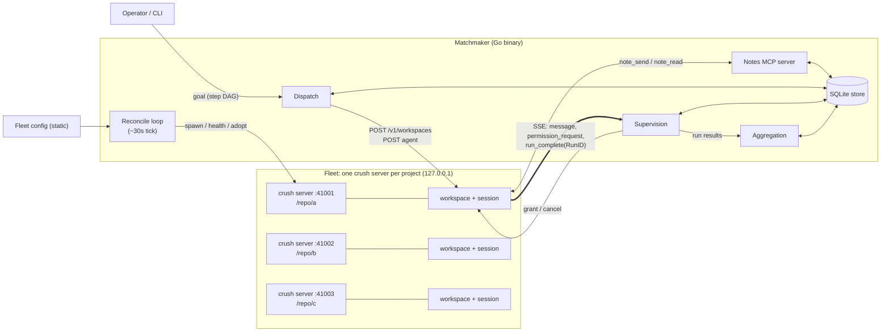

# Matchmaker: Crush Fleet Orchestration — Architecture Specification

Status: Draft
Date: 2026-08-23

## 1. Purpose

Matchmaker coordinates tasks among multiple independent
[Crush](https://github.com/charmbracelet/crush) agents to accomplish a goal.
Given a goal expressed as a graph of steps, Matchmaker routes each step to the
right Crush instance, supervises execution (permissions, retries, lifecycle),
lets agents pass notes to one another while working the same goal, and
aggregates outcomes into a unified result.

Matchmaker is implemented in **Go**, building on the
[charmbracelet](https://github.com/charmbracelet) ecosystem (§10). This document
defines the architecture; the CLI/service split and storage technology are
decided within those constraints.

## 2. Background: Crush Server Mode

Crush ships a first-class client/server mode:

- `crush server [-H host]` starts a long-running process serving a REST API under
  `/v1` (Unix socket by default, TCP via `--host tcp://127.0.0.1:PORT`).
  Swagger docs at `/v1/docs/`.
- A **workspace** is an agent instance bound to a working directory
  (`POST /v1/workspaces`, keyed by `--cwd`).
- **Agent runs**: `POST /v1/workspaces/{id}/agent` submits a prompt. Sessions
  support `cancel`, `summarize`, and queued prompts.
- **Event stream**: `GET /v1/workspaces/{id}/events` is an SSE stream emitting
  `message`, `permission_request`, `session`, `run_complete` (carrying a
  `RunID`), LSP/MCP events, etc.
- **Supervision**: `POST .../permissions/grant`, `POST .../questions/answer`,
  `POST .../sessions/{sid}/cancel`.
- **Lifecycle**: `GET /v1/health` for readiness; `POST /v1/control` with
  `shutdown` / `shutdown_if_idle`.

### 2.1 Relevant constraints of the Crush server

- **C1 — Client-claim lifecycle.** A workspace's lifetime is tied to the
  claiming `client_id`: it is torn down after the client's last SSE stream
  detaches (plus a detach grace and a ~30s creation grace period; defaults
  ~10s/~30s, tunable via env). The server idle-shuts-down (~60s) when no
  workspaces remain. Clients announce exit with `DELETE /v1/clients/{id}`.
- **C2 — No authentication.** The API is single-user and local, with no auth,
  TLS, or origin checks on any endpoint (verified v0.91.2,
  [THREAT_MODEL.md](THREAT_MODEL.md) Appendix). TCP exposure requires
  external access control (bind to loopback, or front with a proxy).
- **C3 — No fleet awareness.** A Crush server knows nothing about other servers.
  Cross-instance coordination is entirely the orchestrator's job.
- **C4 — Version pinning.** Clients check server version/BuildID. The
  orchestrator must tolerate (or trigger) server restarts on version drift.
- **C5 — Evolving API.** The REST surface is documented via the swagger spec
  in-repo, not a stable contract. Pin against a known Crush version per
  deployment.
- **C6 — Dangerous endpoints.** The API surface includes endpoints Matchmaker
  must never call: an unauthenticated remote shell
  (`POST .../agent/sessions/{sid}/shell`, no permission gate), runtime yolo
  (`POST .../permissions/skip`), and config mutation (`config/set`,
  `config/provider-key`). See §6 and THREAT_MODEL Appendix A1.
- **C7 — Executable config.** `crushrc`/`.crushrc` are shell scripts executed
  at config load, and config values undergo shell expansion (`$(cmd)`).
  Creating a workspace on a project executes its config (THREAT_MODEL A2).
- **C8 — In-memory permissions.** Permission grants (including
  `allow_session`) live only in the server process; a restart resets them.
  The only persistent grant is `allowed_tools` in config. There is no
  sandbox behind a grant: gated tools run with full user privileges.

## 3. Topology

**One Crush server per project.** Each managed project runs its own
`crush server` process on a dedicated loopback TCP port. The orchestrator owns
the fleet.



The full rendering lives in [architecture.mmd](architecture.mmd)
([SVG](architecture.svg) / [PNG](architecture.png)), generated with
[mermaid-cli](https://github.com/mermaid-js/mermaid-cli):

```sh
npx @mermaid-js/mermaid-cli -i docs/architecture.mmd -o docs/architecture.svg
```

Rationale for per-project servers (vs. one shared server with many workspaces):

- **Isolation**: a hung or crashed server affects one project, not the fleet.
- **Independent config**: per-project `.crush` data dirs, models, permissions.
- **Independent lifecycle**: servers start/stop/restart per project without
  disturbing other work.

### 3.1 Target abstraction

Work is addressed to an abstract **target** = `(server URL, workspace ID)`,
keeping the door open to shared-server deployments without architectural change.

## 4. Core Concepts

### 4.1 Fleet

The set of projects under management, statically declared in a fleet config:

| Field | Description |
|---|---|
| `name` | Unique project identifier |
| `path` | Absolute path to the project directory (server `--cwd`) |
| `port` | Loopback TCP port for the server |
| `tags` | Labels for step targeting (e.g. `lang:go`, `team:platform`) |
| `crush_flags` | Extra flags for `crush server` (e.g. `--debug`, `--data-dir`) |

The fleet config is the **desired state** input to the reconciliation loop (§5.1).

### 4.2 Instance

A running Crush server plus its managed workspace for one project. States:

`stopped → starting → ready → busy → draining → stopped`
- `failed` (from any state, with reason)

### 4.3 Goal

The top-level unit: a user-supplied objective. A goal decomposes into one or more
**steps** with dependencies — a DAG. Goals are submitted imperatively (API/CLI;
event-driven intake is future work, §8).

### 4.4 Step

One node in a goal's DAG:

- `prompt`: `text/template` text for `POST .../agent`; upstream step outputs
  are referenced, not inlined — the template receives a short excerpt and run
  handle per upstream step, and the agent fetches full results via the note
  tools (§9.5).
- `target`: explicit project names, a tag expression, or `all` (fan-out).
- `needs`: upstream step IDs that must complete first.
- `supervision`: permission policy (`deny` default, `grant_all`, `ask` via hook).
- `timeout`, `retries`.
- `session`: new session per step (default) or pinned session ID.

A fan-out step (target = multiple instances) expands into one run per instance.

### 4.5 Run

One execution of a step on one instance, correlated to the server's `RunID` from
`run_complete` SSE events. Terminal states: `completed`, `failed`, `cancelled`,
`timed_out`.

### 4.6 Notes

Short, addressed messages that Crush agents working the same goal pass to one
another through the orchestrator. A note carries a sender (instance), an
audience (one instance, a tag, or all participants in the goal), and a body
("I own file X", "API response shape changed to Y"). Notes are how
independent agents coordinate mid-goal without sharing sessions. See §5.4.

## 5. Orchestrator Responsibilities

### 5.1 Fleet reconciliation loop

Fleet management is a **periodic reconciliation loop** (default ~30s tick), not
per-failure reactive handling. Each tick:

1. **Observe**: for every fleet entry, poll `/v1/health`; record server version
   (`/v1/version`), workspace presence, SSE stream status.
2. **Compare**: diff observed state against desired state (config + active goals'
   instance demands).
3. **Converge**:
   - Start missing servers: spawn `crush server -H tcp://127.0.0.1:{port}
     --cwd {path}` as a supervised child; await health. The `crush` binary is
     resolved once at startup (absolute path or configured), never per spawn.
   - Create or adopt workspaces; **hold each workspace's SSE stream open** (C1),
     reconnecting with backoff. On adoption, verify `/v1/version` (version +
     build_id) and that the workspace path matches the fleet entry; workspace
     creation is first-create-wins on `yolo`/`data_dir`/`env`, so a foreign
     prior creator must trigger recreation, not adoption (THREAT_MODEL §5.1).
   - Restart drifted instances (config change or version drift, C4) when idle;
     queue the restart if busy. Restarts reset in-memory permission grants
     (C8); supervision re-applies policy from scratch (§5.3).
   - Stop surplus instances (`shutdown_if_idle`, escalating to signals).
   - Quarantine crash-looping instances (max restarts per window) into `failed`.
   - On clean orchestrator shutdown, retire the client claim
     (`DELETE /v1/clients/{id}`) so workspaces tear down promptly (C1).
4. **Adopt on startup**: when the orchestrator itself restarts, the first tick
   discovers live servers and adopts their workspaces rather than respawning —
   combined with the durable store (§5.2), in-flight goals resume.

### 5.2 Durable task store

All goals, steps, runs, and notes are **persisted before dispatch** and
updated at every state transition. This is a hard requirement:

- Orchestrator restart resumes in-flight goals: unfinished steps are re-driven
  from the store, and runs reconcile against server-side session history.
- The store is the source of truth for aggregation and audit.
- Storage is embedded SQLite (§9.2).

### 5.3 Dispatch and supervision

**Dispatch**:

- Resolve each ready step's `target` against the fleet config.
- Demand-start stopped targets via the reconciliation loop.
- Submit the prompt per instance; record run handles in the store.
- Enforce per-instance serialization: one active run per workspace; queue
  additional runs (or use the server's queued-prompts endpoint).
- Gate steps on `needs`; a step becomes dispatchable when all upstream steps
  reach terminal-success state. Failed upstream steps block the branch unless
  the goal defines otherwise (default: skip dependents, mark goal partial).

**Supervision** — consume each instance's SSE stream:

- `permission_request` → apply the step's policy. `deny` rejects, `grant_all`
  answers each event with `grant`, `ask` escalates to the operator (§8) and
  fails closed to `deny` when the operator channel is unavailable.
  `grant_all` is implemented **per event**, never via
  `POST .../permissions/skip` or workspace `yolo: true` — those are
  server-wide, first-create-wins, and unrevocable without recreating the
  workspace (C6, C8). Note: project-configured PreToolUse hooks can
  auto-approve tool calls without a `permission_request` event; `deny` does
  not suppress them (THREAT_MODEL §5.6).
- `run_complete` → mark run terminal, extract results, wake dependents.
- Stream loss → reconnect; if the workspace was torn down (C1), recreate and
  re-attach; an in-flight run whose stream is lost is marked `unknown` and
  reconciled against session state.
- Timeouts → `POST .../sessions/{sid}/cancel`, run becomes `timed_out`.
- Retries → same instance only, with backoff, per step policy. After an
  instance restart, expect renewed `permission_request` events on retry:
  prior grants were in-memory only (C8).

### 5.4 Coordination: passing notes

Agents on the same goal coordinate by **passing notes** through the
orchestrator. Notes are per-goal: an instance only sees notes from participants
in its own goal.

- **Transport**: Crush has no native messaging tool, so the orchestrator runs
  one multiplexed notes **MCP server** (HTTP transport, loopback), registered
  in each project's Crush config. Tools: `note_send(goal, to, body)` and
  `note_read(goal, since)`. `to` is an instance name, a tag, or `all`;
  `goal` multiplexes across goals (§9.4).
- **Registration**: the reconcile loop ensures each managed project's
  `.crushrc` registers the notes MCP server, merging into existing config
  non-destructively (add the `mcp` entry; never remove or rewrite unrelated
  settings; back up before first merge; fail closed on unparseable config).
  Because Crush shell-expands config values (C7), merged entries must be
  literal values only — no `$()`, backticks, or shell metacharacters — and
  no value derived from agent or note content may ever be written into a
  Crush config. Projects that opt out lose live note tools but still receive
  injected notes at dispatch (§5.6).
- **Delivery semantics**: notes are at-least-once and unordered across
  senders. Unread notes addressed to an instance are delivered (a) at the
  start of its next run, injected into the prompt as an untrusted "notes from
  other agents" section, and (b) on demand via `note_read`. Mid-run push
  delivery (interrupting an active run) is explicitly out of scope.
- **Context injection**: when dispatching a step, the orchestrator includes
  pending notes for the target instance, so instances without live note tools
  still receive what was sent to them.
- **Results flow**: downstream steps receive upstream step outputs by
  reference (excerpt + run handle) and pull full results through the note
  tools (§9.5). Notes are for *incidental* coordination (claims, warnings,
  discoveries); references are for *planned* data flow.
- Notes are persisted in the store (§5.2) and survive orchestrator restarts.

### 5.5 Aggregation

- Collect every run's outcome: status, messages/history
  (`GET .../sessions/{sid}/messages` — potentially secret-bearing, handled
  like workspace responses, §6), timing, error details.
- Produce a per-goal report: step DAG annotated with per-run results, notes
  exchanged, and what needs attention. Format is an implementation decision.
  Agent-originated strings are sanitized (control characters stripped)
  before TUI display; reports default to local files with operator
  permissions (THREAT_MODEL §5.4).
- Retain full history (goal → steps → runs → events → notes) for audit and
  `--continue`-style follow-up goals. Every `permission_request` decision
  (policy, request summary, decision) is recorded (THREAT_MODEL §5.3).
  Retention is unbounded by default; a prune/gc subcommand is provided.

### 5.6 Explicit non-responsibilities

- **No shared sessions.** Instances never share Crush sessions; coordination
  happens only through notes.
- **No semantic routing.** Steps target explicit names/tags/`all`. Having an
  agent decompose a natural-language goal into the DAG is future work (§8).
- **Goals are singletons.** A goal's steps run to completion (or partial
  completion) as one pass; re-running means submitting a follow-up goal.
  Recurring execution belongs to event-driven intake (§8).
- **Note tools are per-step capability, not per-instance.** Whether a run's
  agent can call `note_send`/`note_read` depends on the step's declared
  capabilities and the MCP registration in the target project's Crush config;
  instances without note access still receive injected notes (§5.4).
- **No code merging.** The orchestrator reports results; it does not reconcile
  conflicting edits across projects.
- **No implicit repo mutation beyond Crush's own.** Crush server workspace
  creation materializes a `.crush/` data dir inside each managed project
  (verified v0.91.2, §9.6). The orchestrator adds the notes MCP registration
  (§5.4); both should be documented for users, and neither may overwrite
  existing project config.

## 6. Security Model

Scope, trust boundaries, and the full STRIDE analysis live in
[THREAT_MODEL.md](THREAT_MODEL.md); this section is the summary.

- All Crush servers bind to `127.0.0.1` only (C2). Static ports are validated
  for collisions at fleet config load (§9.1).
- The orchestrator is the only client of the fleet and uses a minimal
  endpoint allowlist: it never calls the shell, `permissions/skip`, or
  config-mutation endpoints (C6). If the orchestrator itself ever exposes a
  remote API, authentication is mandatory at that layer.
- Fleet project paths are trusted code: workspace creation executes any
  `crushrc` in the tree (C7). Onboarding a project is an explicit operator
  trust decision; the onboarding flow warns when a `crushrc`/`.crushrc`
  exists.
- Supervision defaults to `deny` for permission requests in unattended
  operation; `grant_all` is an explicit per-step opt-in (equivalent to
  `--yolo`, scoped to a step, implemented per event — §5.3).
- Note content is agent-generated and therefore **attacker-adjacent**: prompts
  consuming notes must treat them as untrusted data, not instructions.
- **Instance-to-instance trust is flat.** Any participant in a goal can send
  notes to any other; there is no per-sender ACL. The fleet is a single trust
  domain.
- No secrets in the fleet config; provider keys remain in each server's own
  config via `POST .../config/provider-key` or on-disk config. Crush API
  responses embed the effective config **including provider API keys**
  (§9.6): the client layer scrubs responses against a field allowlist before
  anything is logged or persisted, including SSE `permission_request`
  payloads, which carry full tool parameters.
- The store and fleet config are created with `0600`/`0700` permissions.

## 7. Failure Modes

| Failure | Detection | Handling |
|---|---|---|
| Server fails to start | reconcile: health timeout | instance `failed` (quarantined after N attempts); affected runs `failed` |
| Server crash mid-run | SSE disconnect + health failure | loop restarts instance; run `unknown`, reconciled from session history; retried per policy |
| Workspace torn down (C1) | reconcile: SSE close / workspace 404 | recreate workspace, re-attach stream |
| Permission request with `deny` policy | SSE event | reject; run continues or fails naturally; noted in report |
| Hung run | step timeout | `cancel` session; run `timed_out` |
| Version drift (C4) | reconcile: version check | restart idle instance; queue if busy |
| Orchestrator restart | — | reload store; first reconcile tick adopts live servers and workspaces; in-flight goals resume from persisted step state |
| Note MCP unreachable from an instance | tool call failure in run | degrade: step runs without note tools; injected pending notes still apply |
| Note tool calls arrive without goal context (server restarted mid-goal) | MCP request for unknown/completed goal | reject with explicit error; note persists if goal still active, else dropped and logged |
| Store (SQLite) locked/corrupt | write failure on transition | crash the orchestrator loudly; on restart, integrity-check before reconcile resumes |

## 8. Future Work

- **Event-driven intake**: cron, webhooks, issue-label triggers that submit
  goals. The durable store and reconcile loop are designed to accommodate this.
- **Goal decomposition / matchmaking**: an agent that turns a natural-language
  goal into a step DAG and selects targets from tags, repo metadata, and
  prior-run outcomes.
- **Operator escalation channel** for `ask` supervision (interactive approval).
- **Remote fleets**: orchestrator-fronted auth (C2) for servers on other hosts.
- **Orchestrator API**: expose goal submission and reports over HTTP so other
  tools can drive the fleet.
- **Run metrics**: token usage and cost per run/goal are not currently
  collected; if the pinned Crush API exposes them, add to aggregation (§5.5).
- **Shared-server topology**: the target abstraction (§3.1) already permits it.

## 9. Decisions

1. **Port allocation — static.** Each project declares its loopback port in the
   fleet config. Simple, predictable, debuggable; the orchestrator validates for
   collisions at config load.
2. **Store — embedded SQLite** ([modernc.org/sqlite](https://gitlab.com/cznic/sqlite)).
   Relational fit for the goal/step/run DAG and note addressing; transactions
   for state transitions; pure Go, so the single-static-binary principle holds.
3. **Pinned Crush version — v0.91.2.** Development and CI pin against this
   release; the version check in the reconcile loop warns on mismatch. The
   client-claim lifecycle (C1) and idle-guarded shutdown are present since
   v0.90.0; v0.91.2 is the verified patch. Bumping the pin requires
   re-running the attack-surface review in THREAT_MODEL Appendix A.
4. **Note transport — one multiplexed MCP server.** Resolved by research:
   Crush registers MCP servers via project-level config (`.crushrc` /
   `.crush.json`, merged over global config) with `http`, `stdio`, and `sse`
   transports. The orchestrator runs a single notes MCP server (HTTP transport,
   loopback); each project config registers it, and `note_send` /
   `note_read` take an explicit `goal` argument to multiplex across goals.
5. **Templating — references, not inlining.** Downstream prompts receive a
   short excerpt of each upstream output plus the run's handle, with
   instructions to fetch full results through the note tools. Planned data flow
   therefore uses the same transport as incidental coordination, output size is
   naturally bounded, and the agent decides how much context to pull. Prompt
   templates use Go `text/template`.
6. **Crush API client — hand-rolled from the swagger spec.** Resolved by
   research: Crush's Go client lives under `internal/` and is not importable.
   The orchestrator ships its own minimal typed client covering the endpoints
   in §2, generated or handwritten from `internal/swagger/swagger.yaml` at the
   pinned version. Verified against v0.91.2 by probing a live server:
   - `POST /v1/workspaces` requires a `client_id` field that **must be a UUID**
     (the orchestrator generates one identity per process lifetime) and a
     `path` field (not `cwd`). Workspace lifetime is tied to the client claim
     (C1); duplicates are first-create-wins on `yolo`/`data_dir`/`env`.
   - `GET /v1/version` returns `{version, commit, build_id, go_version,
     platform}` — `build_id` distinguishes same-version rebuilds.
   - The workspace response embeds the **full effective config, including
     provider API keys**. Treat workspace API responses as secret-bearing:
     never log them raw, never persist them in the store (§6).
   - `POST /v1/control` with `shutdown` is idle-guarded (refused while
     workspaces live); the orchestrator uses `shutdown_if_idle` regardless.
   - The client is allowlist-scoped: it implements only the endpoints in §2
     and §5, and must never grow wrappers for the shell, `permissions/skip`,
     or config-mutation endpoints (C6).

## 10. Implementation Stack

Primary language: **Go**, built on the
[charmbracelet](https://github.com/charmbracelet) ecosystem — the same
libraries Crush itself uses, so the orchestrator stays stylistically and
technically aligned with the thing it orchestrates.

### 10.1 Component mapping

| Concern | Library | Notes |
|---|---|---|
| CLI / commands | [cobra](https://github.com/spf13/cobra) (as in Crush) | goal submission, fleet management, report viewing |
| TUI (dashboard, `ask` approvals) | [bubbletea](https://github.com/charmbracelet/bubbletea) + [bubbles](https://github.com/charmbracelet/bubbles) + [lipgloss](https://github.com/charmbracelet/lipgloss) | live view of goals, runs, and notes; operator escalation UI (§8) |
| Logging | [charmbracelet/log](https://github.com/charmbracelet/log) | structured logs for the reconcile loop and SSE handling |
| Configuration | [viper](https://github.com/spf13/viper) or plain TOML (Crush uses its own config) | fleet config, per-goal policies |
| HTTP client / SSE | stdlib `net/http` + a small SSE reader | hand-rolled typed client for Crush's `/v1` API (§9.6) |
| Durable store | [modernc.org/sqlite](https://gitlab.com/cznic/sqlite) | pure-Go embedded SQLite (§9.2) |
| MCP server (notes) | [mark3labs/mcp-go](https://github.com/mark3labs/mcp-go) or Crush's own MCP packages | hosts `note_send` / `note_read` for instances (§5.4) |
| Process supervision | stdlib `os/exec` | spawn/monitor per-project `crush server` children (§5.1) |

### 10.2 Principles

- **Single static binary**: the orchestrator ships as one `matchmaker` binary
  (CLI, reconcile loop, MCP server, optional TUI are subcommands/modes).
- **No runtime dependencies beyond Crush itself** and a `crush` binary on PATH
  (or a configurable path).
- **Reuse before reinvent**: prefer charmbracelet ecosystem libraries over new
  dependencies. Crush's Go code is all `internal/` and not importable, so reuse
  stops at libraries, not Crush itself (§9.6).
- **Stdlib-first for wire code**: HTTP, SSE, and process management use the
  standard library; third-party deps only where they carry real weight (TUI,
  MCP, storage).
