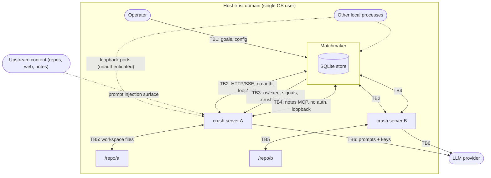

# Matchmaker Threat Model

Status: Draft
Date: 2026-08-28 (updated after source review of charmbracelet/crush at v0.91.2)

Method: [STRIDE](https://learn.microsoft.com/en-us/previous-versions/commerce-server/ee823878(v=cs.20)), selected from the method catalog of the
[OWASP Threat Modelling Guide](https://owasp.org/www-project-threat-modelling-guide/).
STRIDE fits this system because Matchmaker is a process/network orchestrator
whose risks concentrate on spoofed identities, tampered state, repudiated
actions, leaked secrets, resource exhaustion, and privilege escalation across
component boundaries.

This document defines what Matchmaker's threat model covers, what it delegates
to Crush, and where the trust boundaries lie. It refines (and does not
replace) the security model in [SPEC.md §6](SPEC.md). §4.2 and the Appendix
are grounded in a source review of Crush v0.91.2 (the version pinned by SPEC
§9.3); re-verify when the pin moves.

## 1. System description

Matchmaker is a single-operator, single-host orchestrator that coordinates a
fleet of `crush server` processes (one per project, loopback only) to execute
goal DAGs. See [SPEC.md](SPEC.md) §2–5 for the full architecture. Security
relevant facts:

- All Crush servers bind to `127.0.0.1` with **no authentication** (C2) —
  confirmed at source level in v0.91.2: no auth middleware, tokens, TLS, or
  origin checks on any endpoint (`internal/server/server.go`).
- Matchmaker spawns servers as child processes via `os/exec`.
- Matchmaker persists all goals, steps, runs, and notes in a local SQLite
  store **before dispatch**.
- Agents (LLM-driven, executing arbitrary tools inside project workspaces)
  exchange notes through a multiplexed MCP server hosted by Matchmaker on
  loopback, unauthenticated.
- Crush API responses embed provider API keys in plaintext (confirmed:
  `GET /v1/config`, `GET /v1/workspaces`, and `GET /v1/workspaces/{id}/config`
  all serialize resolved keys with no redaction); Matchmaker must not log or
  persist raw API payloads (SPEC §6, §9.6).
- The Crush API includes endpoints far more powerful than Matchmaker needs,
  including an **unauthenticated remote shell**
  (`POST /v1/workspaces/{id}/agent/sessions/{sid}/shell`, no permission gate,
  v0.91.2 `internal/backend/agent.go`) and remote yolo
  (`POST .../permissions/skip`). See the Appendix.

## 2. Actors and assets

### 2.1 Actors

| Actor | Description |
|---|---|
| **Operator** | The single trusted local user who submits goals and owns the fleet config and store. |
| **Agent** | An LLM-driven Crush session executing inside a project workspace. Semi-trusted: it runs arbitrary commands (subject to permission policy) and is susceptible to prompt injection from repository content and from notes. |
| **Co-located local process** | Any other process running as the same (or a privileged) user on the host. Untrusted: can connect to any loopback port. |
| **Upstream content** | Repository files, fetched web content, issue text, note bodies, and **project config files** (`crushrc`, `.crush.json`) that enter an agent's context or Crush's loader. Untrusted and **attacker-adjacent**: an external attacker who can influence repo or note content can attempt indirect prompt injection, and a repo-committed `crushrc` is *executable shell* run by Crush at workspace creation (Appendix A2). |
| **LLM provider** | Remote API endpoint reached only by Crush servers. Outside the host trust domain. |

### 2.2 Assets

| Asset | Security property at stake |
|---|---|
| Fleet config (paths, ports, tags) | Integrity, availability |
| SQLite store (goals, steps, runs, notes, audit history) | Integrity, confidentiality, availability |
| Provider API keys (in Crush configs and API responses) | Confidentiality |
| Managed project working trees (source code) | Integrity |
| Host execution environment | Integrity, availability (agents execute arbitrary commands) |
| Note channel integrity | Authenticity of sender, integrity of body |
| Operator intent | Non-repudiation (audit trail of granted permissions, goals submitted) |

## 3. Trust boundaries

| ID | Boundary | Crosses between | Data crossing | Controls |
|---|---|---|---|---|
| **TB1** | Operator ↔ Matchmaker | Trusted human → orchestrator process | Goal DAGs, fleet config, approval decisions (`ask`) | Local file permissions on config and store; OS user identity. |
| **TB2** | Matchmaker ↔ Crush servers | Orchestrator → unauthenticated loopback HTTP/SSE | Workspace creation, prompts, permission grants, cancels; events, run results, **secret-bearing config responses** | Loopback binding only (SPEC §6); Matchmaker is the only intended client; response scrubbing before log/store (§5.3). |
| **TB3** | Matchmaker ↔ OS (process spawn) | Orchestrator → child processes, filesystem | `os/exec` argv (port, `--cwd`), signals, `.crushrc` merge edits | Static port validation; config merge is additive-only; no shell invocation (argv array, no string interpolation). |
| **TB4** | Agents ↔ Notes MCP server | Semi-trusted agents → unauthenticated loopback MCP endpoint | `note_send(goal, to, body)`, `note_read(goal, since)`; note bodies | Per-goal scoping; bodies treated as untrusted data at consumption (SPEC §6); size and rate limits (§5.2). |
| **TB5** | Agent ↔ project working tree | Semi-trusted agent → source files | Arbitrary reads/writes/commands within the workspace | Crush permission system, supervised by Matchmaker (deny default); out of Matchmaker's direct control (§4.2). |
| **TB6** | Crush servers ↔ LLM providers | Host → remote API | Prompts, tool results, code content; provider keys outbound | Owned entirely by Crush (§4.2). |
| **TB7** | Matchmaker ↔ future remote API | Orchestrator → network listeners | Goal submission, reports | Not in current scope; when added (SPEC §8), authentication is mandatory at that layer (SPEC §6). |

## 4. Scope

### 4.1 In scope (Matchmaker owns)

Threats against components Matchmaker implements or configures:

1. **Fleet config handling** — parsing, port-collision validation, path
   resolution (`--cwd`), additive `.crushrc` merge, and **validation that
   merge results contain no shell-executable values** (Appendix A2).
2. **Store** — SQLite integrity, corruption handling, file permissions,
   injection via stored note/run content read back into prompts or templates.
3. **Dispatch and templating** — prompt template rendering (`text/template`)
   with upstream excerpts and note injection; per-instance serialization.
4. **Supervision** — permission policy enforcement (`deny`/`grant_all`/`ask`),
   timeouts, cancellation, SSE stream handling. Note: Crush permission grants
   are **in-memory per server process** (v0.91.2 `internal/permission`); a
   server restart resets them, which Matchmaker's retry path must account for.
5. **Notes MCP server** — goal scoping, addressing, persistence, rate/size
   limits, injection surface into downstream prompts. Note: Crush
   **auto-starts configured MCP servers with no confirmation** (Appendix A3),
   so Matchmaker's registration edit is the only gate.
6. **Process supervision** — spawn/kill of `crush server` children, adoption
   of pre-existing servers, quarantine logic, and **client-lifecycle
   discipline** (one stable `client_id` per Matchmaker process, `DELETE
   /v1/clients/{id}` on shutdown — v0.91.2 ties workspace lifetime to client
   claims; a leaked/orphaned claim changes teardown behavior).
7. **Secret hygiene** — ensuring provider keys in Crush API responses are
   never logged or persisted (SPEC §9.6, confirmed unredacted in v0.91.2).
8. **Operator surfaces** — CLI argument handling, TUI rendering of
   agent-generated content (terminal escape injection), per-goal report
   generation.
9. **Orchestrator recovery** — adopt-vs-respawn decisions on restart; resume
   of in-flight goals from the store.

### 4.2 Deferred to Crush

Matchmaker relies on Crush for these and does not re-mitigate them. A failure
here is a Crush vulnerability; Matchmaker's mitigations (deny-by-default
supervision, quarantine) limit blast radius only. All items verified against
the v0.91.2 source (see Appendix for endpoint-level detail).

1. **Agent sandboxing and tool gating** — the Crush permission system that
   decides what an agent may do inside its workspace (TB5). There is **no
   sandbox**: gated tools run with full user privileges; controls are the
   permission prompts, a best-effort bash blocklist, and the LSP auto-start
   denylist. Grants are in-memory only (per process, per session).
2. **LLM provider channel security** — TLS, key storage, provider selection,
   and prompt/data egress to providers (TB6). Keys are persisted by Crush at
   `~/.local/share/crush/crush.json` (mode 0600) or the workspace
   `.crush/crush.json`.
3. **Crush server API correctness** — workspace lifecycle (C1; in v0.91.2
   tied to client claims with detach grace), session semantics, event stream
   correctness, and version compatibility (C4, C5).
4. **MCP tool execution** — how Crush discovers, configures, and invokes MCP
   servers and other tools, including auto-starting configured stdio MCP
   servers as arbitrary child processes and permission-gating MCP tool calls
   (with a hardcoded Docker MCP whitelist that bypasses gating).
5. **Provider key storage on disk** — Crush's own config files.
6. **Crush's own local attack surface** — the unauthenticated shell endpoint,
   `/control`, `permissions/skip`, and config-mutation endpoints are exposed
   to any local process. Matchmaker cannot fix this; it can only avoid using
   those endpoints and keep servers on loopback (§4.3.1).
7. **Hook execution** — project-configured PreToolUse hooks are shell commands
   that can auto-approve and rewrite tool calls; they run at the operator's
   trust level and are entirely Crush's domain.

### 4.3 Out of scope (accepted environment)

Explicitly **not defended** in this design; documented as assumptions:

1. **Co-located attacker on the host.** Any local process can connect to the
   unauthenticated loopback Crush and notes MCP ports, impersonate the
   orchestrator or an agent, inject events, or grant permissions — and, worse,
   invoke Crush's **unauthenticated remote-shell endpoint** directly
   (Appendix A1), bypassing Matchmaker's supervision entirely. Mitigating
   this requires OS-level isolation (containers, per-project users, Unix
   socket + peer credentials — noting Crush's default Unix-socket mode does
   not explicitly chmod the socket) and is future work (SPEC §8, remote
   fleets).
   *Accepted risk: Matchmaker targets a single-operator workstation or
   dedicated CI host where local processes are co-trusted.*
2. **Malicious fleet config from the operator.** The operator is trusted;
   a config they write (paths, ports, `crush_flags`) is authoritative.
   **Corollary (new from source review): fleet project paths are trusted
   code.** Creating a workspace on a path executes any `crushrc` in that
   directory tree and shell-expands config values including `$(cmd)`
   (Appendix A2). Matchmaker therefore never points a server at an
   operator-unreviewed checkout; onboarding a new project into the fleet is
   an explicit trust decision by the operator.
3. **Compromised Crush binary or host OS.** Supply-chain and kernel-level
   attacks are outside the model.
4. **Multi-tenancy.** The fleet is a single trust domain (SPEC §6): any goal
   participant can note any other. There are no per-sender ACLs.
5. **Network attackers** — all listeners are loopback; no network-facing
   surface exists until §8 features land, at which point this model must be
   revised (TB7).

## 5. STRIDE analysis

Threats against in-scope components, with the mitigation Matchmaker must
implement. "Existing" means already mandated by SPEC; "Required" means this
model adds a requirement.

### 5.1 Spoofing

| Threat | Boundary | Mitigation |
|---|---|---|
| Local process impersonates the orchestrator to a Crush server (grants permissions, submits prompts) | TB2 | *Accepted* (§4.3.1). Partial: loopback-only binding limits to local actors (existing). |
| Local process impersonates an agent to the notes MCP server (forges `note_send` as another instance) | TB4 | *Accepted* for local processes (§4.3.1). **Required**: bind note sender identity to the calling workspace where derivable (e.g. per-port instance mapping), so *agents* cannot forge each other's sender field even though local processes can forge anything. |
| Orchestrator adopts a foreign process listening on a fleet port as if it were a managed server | TB2/TB3 | **Required**: on adoption, verify `/v1/version` (version + build_id, existing C4 check) and confirm the workspace path matches the fleet entry's `path` before driving it. Note v0.91.2 dedups workspaces by canonicalized path and first-create-wins on `yolo`/`data_dir`/`env` — a foreign process that created the workspace first silently sets those attributes; Matchmaker must verify the workspace's effective config matches expectations or recreate it. |
| Agent claims notes came from a trusted source | TB4 | Existing: notes are labelled "untrusted, from other agents" at injection (SPEC §5.4). **Required**: preserve explicit sender/goal metadata in the injected section; never render notes as operator instructions. |

### 5.2 Tampering

| Threat | Boundary | Mitigation |
|---|---|---|
| Agent tampers with the SQLite store directly (same OS user) | TB1 | *Accepted* (§4.3.1): the store is host-file-permission protected only; agents already have broader local access via Crush tools. |
| Malformed goal DAG (cycles, duplicate step IDs, huge fan-out) corrupts dispatch state | TB1 | **Required**: validate DAG at submission (acyclic, unique IDs, resolvable targets, bounded fan-out) before persisting. |
| Agent-controlled content in store (notes, run output) is read back into templates as executable input | TB1/TB4 | Existing: references-not-inlining and untrusted-labelling (SPEC §9.5, §6). **Required**: `text/template` (not `html/template`) output is never executed by Matchmaker; note/run content is only ever data in prompts. |
| `.crushrc` merge destroys existing project config | TB3 | Existing: additive-only merge, never remove/rewrite unrelated settings (SPEC §5.4). **Required**: back up the file before first merge; fail closed on unparseable config (leave file untouched, mark instance `failed`). **Required (new)**: because Crush shell-expands config values including `$(cmd)` (Appendix A2), Matchmaker's merged entries must be literal values only (no `$()`, backticks, or shell metacharacters in URLs/paths it writes), and Matchmaker must not copy values from agent- or note-influenced content into any Crush config. |
| Repo-committed `crushrc` executes at workspace creation | TB3/TB5 | *Deferred to Crush* (its loader runs it) but **documented as a fleet-onboarding requirement** (§4.3.2): Matchmaker only manages operator-trusted project trees. **Required**: when onboarding a project, warn if a `crushrc`/`.crushrc` exists in it. |
| Store corruption/lock | TB1 | Existing: crash loudly, integrity-check before reconcile resumes (SPEC §7). |

### 5.3 Repudiation

| Threat | Boundary | Mitigation |
|---|---|---|
| Operator cannot reconstruct why a permission was granted or a run retried | TB1 | Existing: full history persisted (goal → steps → runs → events → notes) for audit (SPEC §5.5). **Required**: record the policy decision (policy name, request summary, decision) for every `permission_request` event. |
| Agent denies sending a note | TB4 | Existing: notes persisted before delivery (SPEC §5.2). Weak non-repudiation only — sender is self-asserted; see spoofing. Acceptable within the single trust domain. |

### 5.4 Information disclosure

| Threat | Boundary | Mitigation |
|---|---|---|
| Provider API keys leak via Crush API responses into logs or store | TB2 | Existing: treat workspace responses as secret-bearing; never log raw, never persist (SPEC §9.6). **Required**: implement response scrubbing at the client layer (allowlist of fields that may be logged/stored), not per-call-site discipline. Confirmed in v0.91.2: `GET /v1/config`, `GET /v1/workspaces`, and `GET /v1/workspaces/{id}/config` all return resolved keys unredacted, and SSE `permission_request` events carry full tool parameters (which may include file contents or command lines with embedded secrets) — scrub SSE payloads on the same path. |
| Notes cross goal boundaries (agent reads another goal's notes) | TB4 | Existing: notes are per-goal scoped (SPEC §5.4). **Required**: server-side enforcement — `note_read(goal, …)` returns only notes for that goal, and only if the goal is active and the caller is a participant. |
| TUI/report renders agent content containing terminal escape sequences or credentials the agent read | TB1 | **Required**: sanitize control characters in all agent-originated strings before TUI display; warn that reports may contain workspace-derived secrets and default report output to local files with operator permissions. |
| Store file world-readable | TB1 | **Required**: create store and config with `0600`/`0700` permissions. |

### 5.5 Denial of service

| Threat | Boundary | Mitigation |
|---|---|---|
| Agent floods notes MCP (size/rate) exhausting store or memory | TB4 | **Required**: per-note body size cap, per-goal note count cap, per-sender rate limit; reject with explicit error (SPEC §7 already handles unknown-goal rejection). |
| Crash-looping instance consumes host resources | TB3 | Existing: quarantine after max restarts per window (SPEC §5.1). |
| Hung run or SSE stream wedges supervision | TB2 | Existing: step timeouts → cancel; stream-loss reconciliation (SPEC §5.3). |
| Goal DAG with pathological fan-out (`all` on a large fleet) | TB1 | Existing: fan-out is explicit in the goal (SPEC §4.4); **Required**: bounded fan-out validation at submission (see 5.2). |
| Store growth unbounded (full history retained per SPEC §5.5) | TB1 | **Required**: document retention expectations; provide a prune/gc subcommand. Not a runtime guard in v1. |

### 5.6 Elevation of privilege

| Threat | Boundary | Mitigation |
|---|---|---|
| `grant_all` step escalates agent to unrestricted tool use (`--yolo` equivalent) | TB2/TB5 | Existing: deny-by-default, `grant_all` is explicit per-step opt-in (SPEC §6). **Required**: `ask` escalation must fail closed — if the operator channel is unavailable, treat as `deny`. **Required (new)**: Matchmaker implements `grant_all` by answering individual `permission_request` events with `grant`, **never** by calling `POST .../permissions/skip` or creating the workspace with `yolo: true` — those are server-wide, persist beyond the step, and (for workspace `yolo`) are first-create-wins and cannot be revoked without recreating the workspace. |
| Permission grants silently reset on server restart | TB2 | **Required (new)**: Crush grants are in-memory per process (v0.91.2). After Matchmaker restarts an instance (crash, version drift), previously granted `allow_session`-style approvals are gone; supervision must re-apply the step's policy from scratch and expect renewed `permission_request` events on retry. |
| Prompt injection via notes or upstream content steers an agent into requesting dangerous permissions | TB4/TB5 | Existing: notes labelled untrusted (SPEC §6). Layered: deny-by-default means injected instructions cannot self-authorize; `ask` puts a human in the loop. Residual risk accepted and documented for operators choosing `grant_all`. Note the residual risk is larger than SPEC implies: there is no sandbox behind a grant (Appendix A1), and a project-configured PreToolUse hook can auto-approve calls without Matchmaker seeing them — `deny` policy does not suppress hook pre-approvals. |
| Template injection: goal author (operator) writes a template that exfiltrates — operator is trusted, but a *future* goal-decomposition agent (SPEC §8) would make templates agent-influenced | TB1 | **Required** (forward-looking): keep the template function surface minimal (no file/exec helpers); when §8 decomposition lands, templates become untrusted input and this control becomes mandatory. |
| Matchmaker spawns `crush` via PATH hijack | TB3 | **Required**: resolve the `crush` binary path at startup (absolute path or configurable), verify it is executable and (optionally) check version before spawning; never re-resolve per spawn. |

## 6. Assumptions summary

1. The host is single-operator; all local processes are co-trusted (§4.3.1).
   This assumption carries more weight after the Crush source review: any
   local process has an unauthenticated remote shell on every fleet server
   (Appendix A1).
2. The operator is trusted and is the only goal submitter (until §8), and
   fleet project directories are operator-trusted code (crushrc execution,
   §4.3.2).
3. Crush's permission system works as documented; Matchmaker supervises but
   does not sandbox — and Crush itself provides no sandbox, only gating.
4. All listeners are loopback; there is no network-facing surface in v1.
5. Agents are prompt-injectable; the design assumes injected content will
   eventually reach an agent and mitigates via deny-by-default permissions
   and untrusted labelling rather than prevention.

## 7. Review triggers

Revise this model when any of the following land (all SPEC §8):

- Event-driven intake (cron, webhooks) — new untrusted goal-submitters cross TB1.
- Orchestrator remote API — TB7 becomes live; authentication mandatory.
- Remote fleets — TB2 leaves loopback; §4.3.1 assumption breaks.
- Goal decomposition by an agent — templates become untrusted (§5.6).
- Multi-tenancy or per-sender note ACLs — the flat trust domain assumption (SPEC §6) changes.
- Crush version pin bump — re-run the Appendix review against the new source.

## Appendix: Crush v0.91.2 attack-surface inventory

Source review of `github.com/charmbracelet/crush` at v0.91.2 (local clone:
`~/experiments/crush`), focused on what an orchestrator must know. Crush has
no SECURITY.md or published threat model; its server is designed under a
"same OS user = trusted" assumption. Every control (permissions, bash
blocklist, yolo) gates the *agent*, never the *API client*.

### A1. Unauthenticated API endpoints (all of `/v1`, no auth/TLS/origin checks)

| Endpoint | Capability | Matchmaker exposure |
|---|---|---|
| `POST /v1/workspaces/{id}/agent/sessions/{sid}/shell` | **Arbitrary shell command** in the workspace dir, full user env; no permission gate (`internal/backend/agent.go`) | Never called by Matchmaker; reachable by any local process (accepted, §4.3.1) |
| `POST /v1/workspaces/{id}/permissions/skip` | Enables yolo (disables all permission gating) at runtime | Never called; `grant_all` is implemented per-event instead (§5.6) |
| `POST /v1/control` (`shutdown`) | Server shutdown; in v0.91.2 both spellings are **idle-guarded** (refused while workspaces live) | Used only as `shutdown_if_idle` per SPEC §5.1 |
| `POST /v1/workspaces` | Caller-controlled `path` (any accessible absolute path — no jail), `yolo`, `data_dir`, `env`; first-create-wins on duplicates | Matchmaker always sets explicit values; verifies on adoption (§5.1) |
| `GET /v1/config`, `GET /v1/workspaces`, `GET .../{id}/config` | Return effective config **including resolved provider API keys**, unredacted | Scrubbed at client layer (§5.4) |
| `POST .../config/set`, `config/provider-key`, `config/model` | Mutate config; provider-key **persists keys to disk** (0600) | Matchmaker never mutates provider config |
| `GET .../sessions/{sid}/messages` | Full conversation history | Used by aggregation (SPEC §5.5); treated as potentially secret-bearing |
| `DELETE /v1/clients/{client_id}` (new in v0.91.x) | Retires a client claim; workspace lifetime is tied to client claims with detach grace | Matchmaker keeps one stable `client_id` per process and retires it on shutdown |

### A2. Config is executable

- `crushrc` / `.crushrc` files are **shell scripts executed** by Crush's
  embedded `mvdan/sh` interpreter at config load and reload, walking from the
  workspace path up to the git root (`internal/config/shellconfig`). A
  repo-committed crushrc runs on workspace creation.
- Config values (`api_key`, MCP `command`/`args`/`env`/`url`/`headers`)
  undergo **shell expansion including `$(cmd)`** (`internal/config/resolve.go`).
- `.env` in the working directory is auto-loaded (godotenv import in `main.go`).
- PreToolUse **hooks** are config-defined shell commands that can auto-approve
  a tool call and rewrite its input — they bypass Matchmaker's `deny` policy.

### A3. Agents and tools

- No sandbox: gated tools (bash, write, edit, fetch, LSP, MCP) execute with
  full user privileges once granted. The bash blocklist (curl, ssh, sudo,
  package managers, …) is best-effort prompt-level hardening, not a boundary.
- Permission grants are **in-memory only** (per process; `allow_session` does
  not survive restart). `allowed_tools` in config is the only persistent grant.
- MCP servers from config are **auto-started with no confirmation**; stdio
  MCP = arbitrary child process. MCP tool calls are permission-gated except a
  hardcoded Docker MCP whitelist.
- LSP servers auto-spawn from config on file events (generic interpreters
  denylisted); also startable via the API.
- `CRUSH_PROFILE` starts a pprof server on `localhost:6060`.
- Per-workspace `.crush/` dir is created 0700 with a `*` `.gitignore`; global
  keys live in `~/.local/share/crush/crush.json` (0600).
